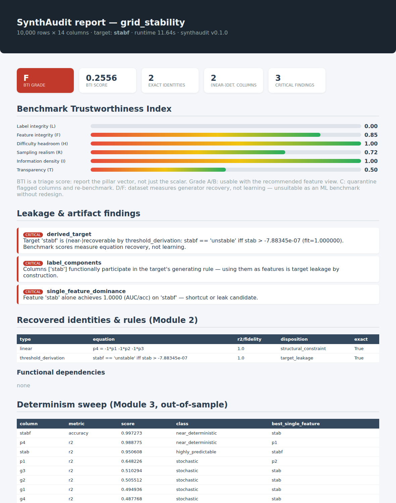

<p align="center">
  
</p>

<p align="center">
  <a href="https://github.com/rvndye/synthaudit/actions/workflows/ci.yml"></a>
  <a href="https://github.com/rvndye/synthaudit/actions/workflows/docs.yml"></a>
  <a href="LICENSE"></a>
  
  <a href="https://github.com/astral-sh/ruff"></a>
  <a href="https://github.com/rvndye/synthaudit/releases"></a>
  <!-- TODO after Zenodo archiving: <a href="https://doi.org/10.5281/zenodo.XXXXXXX"></a> -->
</p>

**SynthAudit is a reference-free auditor for synthetic and simulated tabular
datasets.** Point it at a released CSV, with no access to the real source data
and no access to the generator, and it recovers the generator's fingerprints
before you train anything: exact equations between columns, labels that are
thresholds or rules over shipped features, functional dependencies, balance
constraints, schedule leakage, duplicated and constant columns. It then
classifies every column, separates *benchmark leakage* from *legitimate
physical structure*, and scores the release with a decomposable **Benchmark
Trustworthiness Index (BTI)**.

Why this matters: many widely used synthetic benchmarks quietly ship their own
answer key, and models "solve" the generator rather than the task. Findings
from the audits in [`reports/`](reports), each produced by one command:

| Dataset | What SynthAudit found (from the file alone) | Grade |
|---|---|:---:|
| Electrical Grid Stability (UCI) | `stabf == 'unstable'  iff  stab > 0`, the label is the sign of a shipped column, plus the power balance `p4 = -(p1+p2+p3)` | **F** |
| AI4I 2020 (UCI) | `Machine failure = rules(TWF, HDF, PWF, OSF)` at fidelity 0.9991, and the 9 rule-violating rows are the dataset's independently documented generator bugs | **F** |
| Synthea `medications` | `TOTALCOST = BASE_COST x DISPENSES`, exact on all 42,989 rows | **F** |
| NSL-KDD | Label is clean (the famous deduplication worked), but **610 rows of the official test file appear verbatim in the training file** | **B** |
| BATADAL | Dozens of hydraulic identities, all correctly classified as physics rather than leakage; attack windows mandate temporal splits | **A** |
| Tennessee Eastman | 19 structural constraints, zero target leakage: determinism is not punished, shipping the answer is | **B** |

The methodology, the index, formal guarantees, a planted-artifact validation
testbed (full recall, zero false positives), a leave-one-module-out ablation,
and twelve cross-domain case studies are described in the accompanying paper
(see [Citation](#citation)).

## Installation

```bash
pip install synthaudit            # core  (PyPI release pending; see below)
pip install "synthaudit[causal]"  # + causal-learn for the causal structure scan
```

Until the PyPI release lands, install from GitHub:

```bash
pip install "synthaudit[causal] @ git+https://github.com/rvndye/synthaudit.git"
```

## Quick start

```python
import pandas as pd
from synthaudit import Audit

df = pd.read_csv("datasets/grid_stability.csv")

audit = Audit(df, target="stabf", name="grid_stability",
              metadata={"generator_described": True,
                        "generator_code_available": False,
                        "seed_reported": False,
                        "artifacts_disclosed": True})
results = audit.run()

audit.generate_report("grid_report.html")   # self-contained HTML report
audit.export_pdf("grid_scorecard.pdf")      # one-page scorecard
audit.export_json("grid_audit.json")        # machine-readable findings
print(audit.bti, results["scoring"]["grade"])
```

Or from the command line, including as a CI gate for your data pipeline:

```bash
synthaudit audit datasets/grid_stability.csv --target stabf --html report.html
synthaudit audit train.csv --target label --fail-below C   # nonzero exit if grade < C
synthaudit selftest                                        # planted-artifact self-validation
```

<p align="center">
  
</p>

## What it detects

| Artifact class | Example | Detector |
|---|---|---|
| Linear identities | `cost = power x tariff` | Gram-based minimal OLS with backward elimination |
| Balance constraints | `p4 = -(p1+p2+p3)` | same miner, symmetric constraint collapse |
| Power laws | `TOTALCOST = BASE_COST x DISPENSES` | log-space mining |
| Regime-affine equations | `eff = base(type) - 0.015*age` | fixed-effects demeaning |
| Rule-derived labels | AI4I's failure flag | shallow-tree fidelity with imbalance guards |
| Threshold / sign labels | `stabf = sign(stab)` | exact separation scan |
| Functional dependencies | `CODE -> DESCRIPTION` | g3 mining with non-degeneracy guard |
| Chained derivations | duplicate of x re-expresses every identity of x | **iterative peeling** |
| Residual determinism | nonlinear derived columns | out-of-sample GBM sweep (skill-banded) |
| Schedule leakage | attacks in contiguous windows | target autocorrelation screen |
| Contamination | train/test row overlap | hash join across supplied splits |

Every recovered relation carries a **disposition**: `target_leakage` (the
posed task is answerable by arithmetic), `structural_constraint` (legitimate
physics or accounting among non-target columns), or `redundancy`. Conservation
laws are not crimes; shipping the label's source column is.

## The Benchmark Trustworthiness Index

Five measured pillars, each in [0, 1] with an explicit estimator: **L**abel
integrity, **F**eature integrity, difficulty **H**eadroom, sampling
**R**ealism, **I**nformation density, plus optional metadata-driven
**T**ransparency. Aggregation is a weighted geometric mean, which is provably
non-compensatory: a dataset whose label is exactly recoverable is capped in
the F band no matter how clean everything else is, and a release disclosing
nothing about its generator caps near C. The pillar vector and the recovered
evidence ship with every score; the scalar alone is never the deliverable.
Grades map to actions: A/B use with the recommended feature view, C repair
and re-audit, D/F the shipped task measures generator recovery.

## API overview

| Object / function | Purpose |
|---|---|
| `Audit(data, target, name, metadata, test_data, seed, modules, identity_kwargs)` | orchestrates the seven audit modules |
| `Audit.run()` | returns the full results tree (profile, identity, determinism, causal, leakage, taxonomy, scoring, recommendations) |
| `Audit.generate_report / export_html / export_pdf / export_json / export_notebook` | deliverables |
| `Audit.bti` | the scalar index (pillar vector lives in `results["scoring"]`) |
| `synthaudit.make_planted(n, seed, extended)` | the planted-artifact validation testbed |
| `synthaudit.score_detection(results, truth)` | recall and negative-control scoring against planted ground truth |

Full reference: **[documentation site](https://rvndye.github.io/synthaudit/)**
(installation, tutorial, theory, architecture, BTI, artifact taxonomy, API,
developer guide, FAQ).

## Reproducing the paper's results

```bash
make selftest          # planted-artifact validation (recall + negative controls)
make audit-example     # audits the three bundled datasets into reports/
bash scripts/download_datasets.sh   # fetches the remaining public cohort datasets
python scripts/audit_cohort.py      # regenerates reports/ and benchmarks/ tables
```

Bundled small datasets (with attribution in [`datasets/README.md`](datasets/README.md)):
AI4I 2020 and Electrical Grid Stability (UCI, CC BY 4.0) and one Synthea table
(Apache-2.0). Audit outputs for all twelve cohort datasets are in
[`reports/`](reports); ablation and stability tables in [`benchmarks/`](benchmarks).

## Citation

If you use SynthAudit in your research, please cite the software release:

```bibtex
@software{erwin2026synthaudit,
  author  = {Erwin, Randy},
  title   = {SynthAudit: Reference-Free Auditing of Synthetic Datasets
             for Generator Artifacts Before Machine Learning},
  year    = {2026},
  version = {0.1.0},
  url     = {https://github.com/rvndye/synthaudit}
}
```

The methodology paper is under submission (JMLR); the entry above will be
updated on acceptance, and `CITATION.cff` carries the canonical metadata.

## Contributing

Contributions are welcome: new artifact detectors, dataset audits, docs, and
bug reports alike. Start with [CONTRIBUTING.md](CONTRIBUTING.md) and the
[developer guide](https://rvndye.github.io/synthaudit/developer-guide/).
Found a generator artifact in a public benchmark using SynthAudit? Open an
issue with the *Audit finding* template; confirmed findings are collected in
the documentation.

## Roadmap

Planned directions, roughly ordered: temporal auditing (lagged identities,
dynamics mining, split-protocol certification), relational multi-table audits
(cross-table dependency graphs), an opt-in symbolic-regression backend for
out-of-class equations, latent-regime and masked-category scans, a multi-probe
headroom panel, and auditors for LLM-generated benchmarks. See the
[open issues](https://github.com/rvndye/synthaudit/issues) for current status.

## License

[Apache License 2.0](LICENSE). Bundled datasets keep their original licenses,
documented in [`datasets/README.md`](datasets/README.md).
